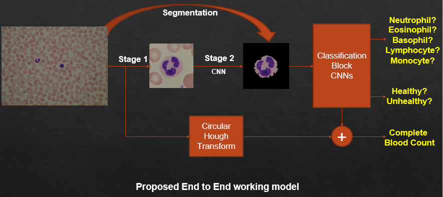

# Blood Cell Characterization

<h2 style="color:#1589F0">Problem Statement</h2>

- Most of the blood test results for diseases are based on the cell structure and cell count. Pathologists analyse blood samples under microscope and gives results which is time taking process and also error prone in some cases
- Since the development of digital microscopes and machine learning techniques, many attempts were made to automate the process
- The existing models in the market are costly. There are few startups working to develop a low cost slide scanner with a trade off between cost and quality of blood smear images
- <strong style="color:#c5f015"> Aim is to develop an end-to-end model, with image processing techniques and machine learning algorithms, which can process microscopic images to count blood cells, classify white blood cells and predict probable diseases. </strong>

  <figure>
     
    <figcaption>Fig.1 - A typical blood smear slide image under microscope</figcaption>
  </figure> 

 

<h2 style="color:#1589F0">Work Done</h2>

- Applied an image processing technique with few pre-processing steps to count Red Blood Cells (RBCs) in the blood smear image.
- Identified and segmented out White blood cells (WBCs) from blood smear image.
- Applied a machine learning algorithm to do semantic segmentation of White blood cells from segmented images.
- Developed a machine learning algorithm to classify segmented WBCs into four sub-categories.
- Worked on <strong style="color:#c5f015"> "Classification of Normal vs Malignant Cells in B-ALL White Blood Cancer Microscopic Images" </strong> : ISBI 2019 challenge hosted by SBI Lab, IIIT Delhi.
- Developed an ensemble based machine learning model to classify leukemic B-lymphoblast cells from normal B-lymphoid precursors from blood smear microscopic images

  <figure>
     
    <figcaption>Fig.2 - Proposed end to end model</figcaption>
  </figure> 

 

<h2 style="color:#1589F0">Results</h2>

- Presently, our image processing technique is able to count RBC up to 97% accuracy excluding overlapped cells.
- Developed ensemble based machine learning algorithm is able to produce an <strong style="color:#c5f015"> accuracy of 94% in classification of WBCs into sub-categories. </strong>
- The same model when trained for two class classification of **leukemic B-lymphoblast cells from normal B-lymphoid precursors** produced an <strong style="color:#c5f015"> accuracy of 82%. </strong>

  <figure>
     
    <figcaption>Fig.3 - Performances of of different architectures/approaches on Classification of leukemic B-lymphoblast cells from normal B-lymphoid precursors</figcaption>
  </figure> 

<h2 style="color:#1589F0">Datasets</h2>

- [C_NMC_2019 Dataset by SBI Lab, IIIT Delhi.](https://competitions.codalab.org/competitions/20429)
- [ALL_IDB1 and ALL_IDB2 datasets](https://homes.di.unimi.it/scotti/all/#datasets)
- [WBCs Dataset from Blood Cell Images, Kaggle](https://www.kaggle.com/paultimothymooney/blood-cells)

<h2 style="color:#1589F0">Future Work</h2>

- Acquire the real data-set of blood smear images from blood slide scanner/profiler
- Apply active learning based training for ensemble based architecture and analyse the results
- High level Work Plan: Build an end-to-end Convolutional Neural Network with detection & segmentation of cells followed by classification of cells and prediction of few diseases with in Active Learning framework
